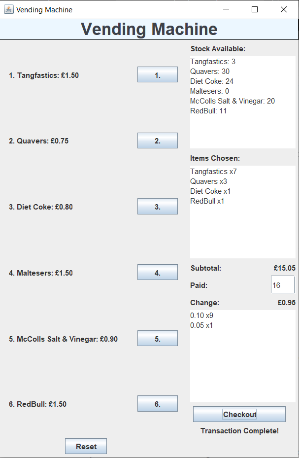

# Vending Machine Java App

## Self-set Requirements
* Vending machine which contains items with name, category, price and stock.
* Appropriate accessor methods
* Vending Machine with GUI containing buttons to choose and then pay for items.
* Use of Event-Driven Programming
* HashMap mapping the hashCode of an Item as the key to itself as the value.
* Transaction which takes the selected Items and adds their cost then edits the stock value.
* Change making problem within each transaction taking the user's cash and returning correct change from coins available.


## Why Did I Do This Project?
* I did this project to increase my portfolio and further my experience in Java. I specifically wanted improve my knowledge on the following: 
    - Object Orientated programming in Java with good abstraction and encapsulation using appropriate accessor methods along with getters and setters.
    - GUI development and creating a Java application.
    - Java data structures such as HashMaps, ArrayLists and Arrays.
    - Good programming standards commenting, consistent variable names and reduction of code duplication.
    
    
## What I Used
* Java 13 with IntelliJ as the IDE for the whole project.
* I used the Swing GUI widget toolkit for Java. IntelliJ has a built in GUI designer which made things much quicker.


## Implementation
* VendingGUI class bringing all the code together into a functioning GUI. Features:
    - User can select Items they want to buy
    - User can enter the amount they have available to pay which must be >= to the total.
    - Correct change is displayed after the user attempts to checkout.
    
* VendingMachine class
    - Contains itemsMapping HashMap which maps the hashCode of an Item to its object instance.
    - updateStock() method to update the stock for each item once a Transaction complete.
* Transaction class
    - Has a calculateCost() method which takes an ItemQuantity ArrayList as a parameter and returns the cost for all the items.
    - Inherits ChangeCalculation, so it's methods can be used.
* Item class
    - Item has attributes name, price, category and stock.
    - Appropriate getters and setters used.
* A recursive change function calculated the minimum quantity of coins for the set of coins available. I first worked this algorithm out on paper before attempting to code it. Here is the idea:
    - The change is converted to an int then multiplied by 100 before being sent as a parameter to recursiveChange (e.g. 19.95 became 1995) as I just found this easier to deal with.
    - The change (V) is checked against each available coin in the coin set.
    - There is also a count parameter which starts at 0 and is used to iterate through all the coins.
    - The coin set must be in descending order (e.g. {2000,1000,100,...,1})
    - If V < current coin value then the coin size is too large for the current change left
```java
    if(V >= current_coin)
```
- If the above if statement is correct then the remainder, floored division with the change and the current coin is temporarily set.
```java
    // example V=223,current_coin=100 then Vmod=23 Vdiv=2.
    Vmod = Math.floorMod(V, current_coin);
    Vdiv = Math.floorDiv(V, current_coin);
```
-  If Vmod == 0 then there is no remainder left, and the division was whole (e.g. 10/5=2 no remainder). Then add the final coin and it's quantity to the coinQuantities ArrayList.
```java
    if (Vmod == 0){
        // add final coin and amount
        CoinQuantity coinQuantity = new CoinQuantity(current_coin, Vdiv);
        coinQuantities.add(coinQuantity);
```
- If the above if statement is not true and there was a remainder then current coin needs to be added to the coinQuantities ArrayList along with the amount of floored divisions (e.g. 10/4=2.5 flooredDiv = 2). The recursiveChange function calls itself with the count being incremented and new V value being the remainder Vmod.
```java
    else {
        CoinQuantity coinQuantity = new CoinQuantity(current_coin, Vdiv);
        coinQuantities.add(coinQuantity);
        recursiveChange(count+1,Vmod);
    }
```
- If the first if statement checking V >= current_coin is false the else statement calls recursiveChange() again with count incremented but V remains the same as the coin was too large.
```java
    else{
        // example V=123 current_coin=200
        recursiveChange(count+1, V);
    }
```
- Finally if count is incremented past the length of the coins array -1 then the change could not be made with the coins available and the coinQuantities ArrayList is cleared.
```java
    // base case if all coins used and V did not reach 0
    if (count > coins.length-1){
        coinQuantities.clear();
    }
```

## Finished Design



## What Could Be Improved?
* Currently, there is a HashMap mapping each item's hashCode to the Item object itself. There is also a btnMap HashMap mapping each button to the hashCode of the Item related to that button. This seems really stupid but If you think about it a real vending machine has an Item's related ID such as A3 or B2 for the rows and columns so that was why I chose to implement it that way.
* The obvious improvement would be to integrate the VendingMachine with a database which stores all the Item's attributes and stock values then CRUD methods access and change the Item's as events take place on the GUI. This could be extended to record total profit and popular items.
* 


# To implement
* No change needed and transaction complete if total==amount paid
* Update stock so user cannot add if no stock left